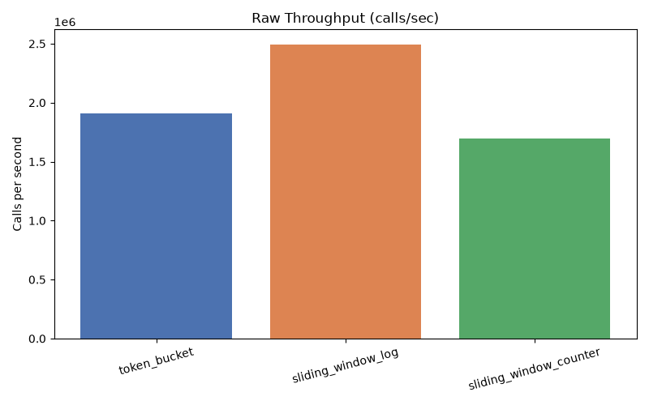
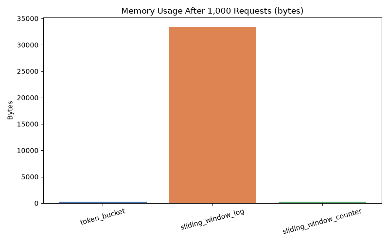
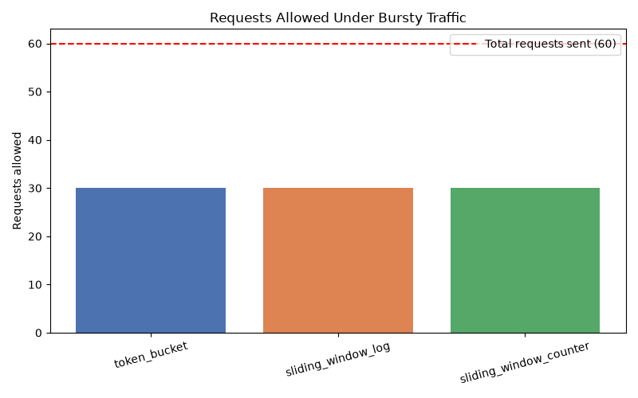

# Rate Limiter Service

[](LICENSE)
[](https://www.python.org/)
[](https://fastapi.tiangolo.com/)

A from-scratch implementation and empirical comparison of three classic rate-limiting algorithms — Token Bucket, Sliding Window Log, and Sliding Window Counter — wrapped in a FastAPI middleware and benchmarked for throughput, memory footprint, and accuracy under bursty traffic.

Rate limiters are a foundational system-design building block, used by nearly every public API (Stripe, GitHub, Cloudflare) to protect against abuse and enforce fair usage. This project implements the three most common approaches from first principles, then measures where their real-world tradeoffs actually show up.

## Contents

- [Algorithms](#algorithms)
- [Architecture](#architecture)
- [Setup & Usage](#setup--usage)
- [Benchmark Results](#benchmark-results)
- [Key Takeaways](#key-takeaways)
- [Project Structure](#project-structure)

## Algorithms

| Algorithm | How it works | Memory | Accuracy |
|---|---|---|---|
| **Token Bucket** | A bucket of tokens refills at a fixed rate; each request consumes one token. | O(1) constant | Approximate — allows bursts by design |
| **Sliding Window Log** | Stores a timestamp per allowed request within a rolling window; evicts expired entries on each check. | O(n) — scales with requests per window | Exact — no approximation |
| **Sliding Window Counter** | Approximates a rolling window using two fixed-window counters (current + previous), weighted by time-based overlap. | O(1) constant | Approximate — small error near window boundaries |

All three are implemented as standalone, framework-agnostic classes with no dependency on the web layer, so they can be unit tested and benchmarked in isolation before ever touching HTTP.

## Architecture

Client Request
│
▼
FastAPI Middleware (app.py)
│  identifies client (IP), fetches/creates their limiter instance
▼
Limiter.allow_request()  ──►  True  ──► request proceeds normally
│
└────────────────────►  False ──► 429 Too Many Requests

Each client is tracked independently via a per-client limiter instance, so one user hitting their limit never affects another. The algorithm used is configurable via a single constant in `app.py`, which is what makes it possible to benchmark all three against identical infrastructure.

## Setup & Usage

```bash
git clone https://github.com/YOUR-USERNAME/rate-limiter-service.git
cd rate-limiter-service

python -m venv venv
source venv/bin/activate        # Windows: venv\Scripts\activate

pip install fastapi uvicorn pytest matplotlib
```

**Run the test suite:**
```bash
pytest tests/ -v
```

**Run the API:**
```bash
uvicorn app:app --reload
```
Then send repeated requests to `http://127.0.0.1:8000/` — after the configured limit, responses switch from `200 OK` to `429 Too Many Requests`. Change which algorithm is active by editing `ALGORITHM` in `app.py`.

**Run the benchmark suite:**
```bash
python benchmark.py
```
Prints throughput, memory, and accuracy results to the console and saves comparison graphs to `results/`.

## Benchmark Results

### Throughput — raw calls/sec, no delay between calls



| Algorithm | Calls/sec |
|---|---|
| Token Bucket | ~1.9M |
| Sliding Window Log | ~2.5M |
| Sliding Window Counter | ~1.7M |

Sliding Window Log was, unexpectedly, the *fastest* of the three — not the slowest, as its growing timestamp log initially suggested it would be. The reason is that evicting an expired timestamp from a `deque` is an O(1) operation: each request only touches the handful of entries that are actually expired, never the full history. Its speed doesn't degrade with scale — its real cost lives elsewhere.

### Memory usage — bytes, after 1,000 requests



| Algorithm | Bytes |
|---|---|
| Token Bucket | 272 |
| Sliding Window Log | 33,480 |
| Sliding Window Counter | 272 |

This is where the real tradeoff surfaces. Token Bucket and Sliding Window Counter hold constant, fixed-size state regardless of traffic volume. Sliding Window Log stores one timestamp per request in the current window — roughly **123x more memory** at this test's scale, growing further at higher request volumes. Its exactness is bought with memory, not CPU time.

### Accuracy under bursty traffic



Simulated 3 bursts of 20 requests, 1 second apart, against a limit of 10 requests/window. Token Bucket and Sliding Window Log consistently allowed the expected count. Sliding Window Counter was measurably more conservative in most runs, since its two-window weighted approximation still partially penalizes a new burst based on the previous window's activity — and its exact result shifts slightly run-to-run, since the weighting depends on real timing precision between bursts.

## Key Takeaways

- **Token Bucket** — the sensible default for most public APIs. Cheap, forgiving of natural bursts, easy to reason about.
- **Sliding Window Log** — best when exact enforcement matters more than memory cost (e.g. billing-sensitive limits), or when per-window traffic volume is naturally low.
- **Sliding Window Counter** — a practical middle ground: constant memory with reasonably close accuracy, at the cost of some imprecision near window boundaries.

## Project Structure

rate-limiter-service/
├── limiters/                    # Framework-agnostic algorithm implementations
│   ├── token_bucket.py
│   ├── sliding_window_log.py
│   └── sliding_window_counter.py
├── tests/                       # Unit tests per algorithm
├── app.py                       # FastAPI app using the limiters as middleware
├── benchmark.py                 # Benchmark suite + graph generation
├── results/                     # Generated benchmark graphs (PNG)
├── LICENSE
└── README.md

## License

MIT — see [LICENSE](LICENSE) for details.